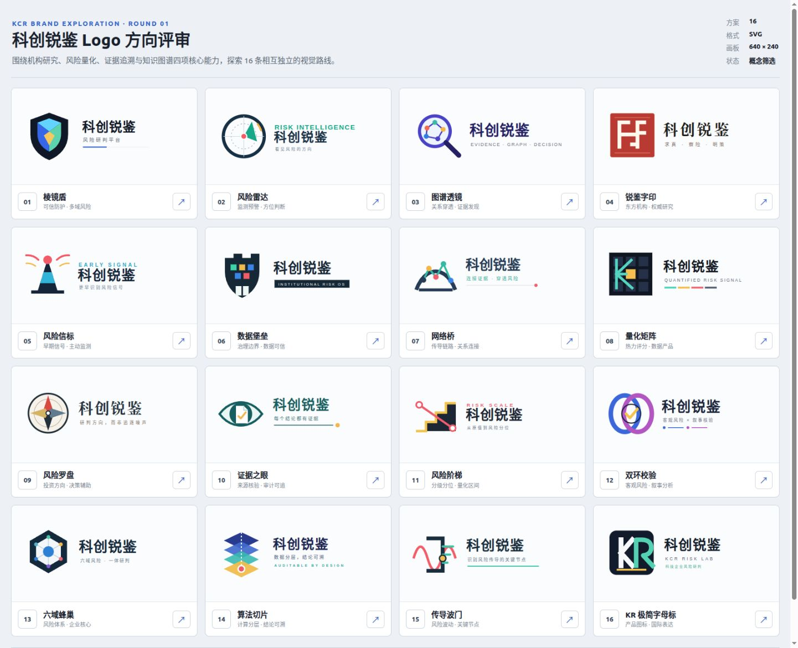

# 科创锐鉴 Logo 概念探索

本目录包含 16 个独立矢量方向，用于确定品牌视觉路线。当前均为概念稿，尚未替换产品中的 `ShieldCheckIcon`，也未进行商标近似检索。

## 设计依据

- 产品定位：面向投资者与机构研究人员的科创企业风险研判平台。
- 核心语义：风险量化、证据追溯、关系传导、知识图谱与投资辅助决策。
- 字标：`科创锐鉴`；辅助说明根据方向使用 `风险研判平台` 或对应英文短语。
- 输出格式：每个方案为 `640 × 240` SVG，可无损缩放并继续编辑。

## 方向索引

| 编号 | 方向 | 核心语义 |
| --- | --- | --- |
| 01 | 棱镜盾 | 可信防护、多域风险 |
| 02 | 风险雷达 | 监测预警、方位判断 |
| 03 | 图谱透镜 | 关系穿透、证据发现 |
| 04 | 锐鉴字印 | 东方机构、权威研究 |
| 05 | 风险信标 | 早期信号、主动监测 |
| 06 | 数据堡垒 | 治理边界、数据可信 |
| 07 | 网络桥 | 传导链路、关系连接 |
| 08 | 量化矩阵 | 热力评分、数据产品 |
| 09 | 风险罗盘 | 投资方向、决策辅助 |
| 10 | 证据之眼 | 来源核验、审计可追 |
| 11 | 风险阶梯 | 分级分位、量化区间 |
| 12 | 双环校验 | 客观风险、叙事分析 |
| 13 | 六域蜂巢 | 风险体系、企业核心 |
| 14 | 算法切片 | 计算分层、结论可溯 |
| 15 | 传导波门 | 风险波动、关键节点 |
| 16 | KR 极简字母标 | 产品图标、国际表达 |

## 评审建议

先选 2–3 个方向，再分别制作纯图标、横向字标、深浅色版本与 16/24/32px 小尺寸测试。定稿前需要完成字体授权和商标近似检索。
