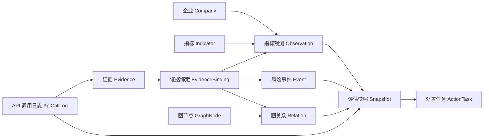

# KCR-2026.08-v1 统一数据模型

状态：**可供导入器、评分引擎、API 和前端共同使用**

实现位置：`src/domain/kcr-v1/`

## 为什么需要这一层

旧页面的数据分散在多个静态 JSON、浏览器 `localStorage` 和技术专项请求结构中。
新版 MVP 需要一条稳定的数据主链，否则同一个风险结论会在页面、报告和接口中出现
不同版本。

统一模型把“事实、证据、计算结果和行动”分开保存，再通过稳定 ID 显式连接。

## 核心实体

| 实体 | 只负责什么 | 关键边界 |
| --- | --- | --- |
| `KcrCompany` | 企业身份与基本分类 | 不保存风险分 |
| `KcrIndicator` | 22 项指标的定义、权重和计分资格 | 叙事指标的维度、权重和规则必须为空 |
| `KcrIndicatorObservation` | 某企业、某期间的一次原始观测及标准化风险分 | 缺失必须用 `null`，不能补 0 |
| `KcrEvidence` | 来源、链接、位置、时间、置信度和分发边界 | 不直接决定支持哪个结论 |
| `KcrEvidenceBinding` | 证据与观测、事件、关系或快照之间的显式连接 | 推断证据必须写明推断依据 |
| `KcrRiskEvent` | 具有时间、严重度和处置状态的风险事实 | 红旗使用独立布尔标记 |
| `KcrGraphNode` / `KcrGraphRelation` | 知识图谱节点、事实边和推断边 | 事实/推断分离，关系强度与置信度分离 |
| `KcrAssessmentSnapshot` | 某个评估时点的不可变方法输出 | 保存版本、截止日期、缺口、红旗和输入观测 ID |
| `KcrActionTask` | 从风险输出到责任人、截止日期和状态的闭环 | 必须追溯到快照及事件/指标/关系 |
| `KcrApiCallLog` | 商业 API 的用途、结果数量、成本和状态 | 不保存密钥、Token 或完整原始请求/响应 |

## 自动守住的不变量

`collectKcrDatasetIssues` 返回所有问题，适合 Excel 导入时一次性展示；
`assertKcrDataset` 在 API 或构建阶段发现问题后立即拒绝数据。

- 数据与方法版本必须分别为 `KCR-DATA-2026.08-v1`、`KCR-2026.08-v1`。
- 指标集合固定为 18 个加权指标和 4 个叙事校验项，总权重固定为 100。
- 企业、指标、证据、快照、事件和关系之间不得出现悬空或跨企业引用。
- 风险分只能为 `0–100`，覆盖率、置信度和关系强度只能为 `0–1`。
- 有风险分的观测必须绑定直接证据或写明依据的推断证据。
- 叙事校验项永远不能生成风险分。
- 快照必须包含且只能包含新版 5 个风险维度。
- 红旗快照引用必须指向本企业且明确标记为红旗的事件。
- API 成本不得为负，日志结构中没有密钥或原始响应字段。

## 后续接入顺序

1. 第 3 步把 Excel 行解析成这些实体，并一次性返回全部校验问题。
2. 第 4 步评分引擎只读取已通过契约校验的观测和证据绑定。
3. 第 5 步 API 返回 `KcrAssessmentSnapshot` 及其关联实体。
4. 第 6 步前端停止直接读取旧静态 JSON，改为消费统一 API。

旧版 `src/types/risk.ts` 暂时保留，只服务尚未迁移的现有页面；新代码不得继续向
旧类型文件追加新版模型。
